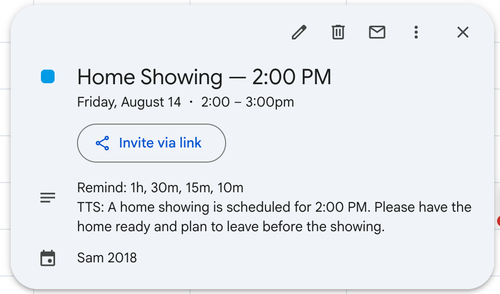
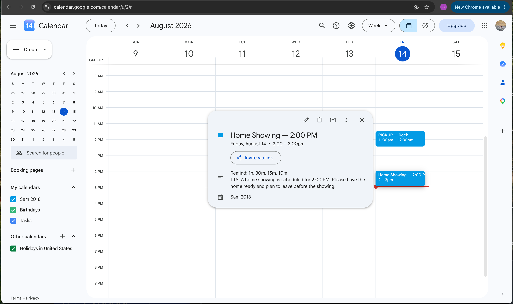

Smart Showing can use shared calendar events to provide scheduled voice reminders inside the property.

An authorized user can create or update an event remotely. Smart Showing reads the scheduled event and can announce configured reminders through speakers in the property.

This allows a familiar calendar to remain the central scheduling tool while Smart Showing provides audible reminders where they are needed.

## Realtor-Managed Events

A real estate agent may remotely schedule events related to the listing.

Examples include:

- Property showings
- Open houses
- Photography appointments
- Staging appointments
- Inspections
- Appraisals
- Cleaning services
- Repair or maintenance contractors
- Deliveries
- Other listing-related visits

For example, a real estate agent can create a normal calendar event for an upcoming showing and include the reminder schedule and spoken message.

In this example, the showing is scheduled for **2:00 PM** with reminders:

- 1 hour before
- 30 minutes before
- 15 minutes before
- 10 minutes before

Smart Showing can announce:

**30 minute reminder. A home showing is scheduled for 2:00 PM. Please have the home ready and plan to leave before the showing.**

Additional reminders can be provided as the appointment approaches.

## Homeowner & Family Events

When the property is occupied, the homeowner may also use calendar-based voice reminders for everyday activities.

Examples include:

- School schedules
- Picking up or dropping off children
- Dentist or medical appointments
- Family appointments
- Household tasks
- Mail or delivery reminders
- Recurring activities
- Other personal reminders

For example:

**15 minute reminder. It is almost time to leave for school.**

This allows the installed system to provide useful household support while the home remains listed.

## Shared Scheduling

More than one authorized person may participate in scheduling.

For example, a real estate agent may manage showing-related appointments while the homeowner manages personal or family events.

In this example, the same calendar contains both a **Home Showing** scheduled by or for the real estate transaction and a **PICKUP — Rock** household event.

The calendar provides a familiar interface for creating, updating, repeating, moving, or canceling events.

## Recurring Events

Recurring calendar events can be used for schedules that repeat regularly.

Examples include:

- School transportation
- Weekly property services
- Recurring contractor visits
- Routine household reminders
- Regular appointments

If one occurrence changes, the calendar event can be adjusted without rebuilding the Smart Showing automation.

## Flexible Reminder Times

An event may include multiple reminder intervals.

For example, an 11:30 AM appointment could provide reminders:

- 1 hour before
- 30 minutes before
- 15 minutes before
- 10 minutes before

Smart Showing can announce both the remaining reminder interval and the event message.

For example:

**25 minute reminder. Pick up Rock from school at 11:30 AM.**

## Remote Updates

The person creating or editing an event does not need to be at the property.

Changes made remotely can be reflected in the property's future voice reminders.

This allows agents, homeowners, family members, or other authorized users to manage upcoming activities without requiring direct interaction with the Smart Showing equipment.

## Familiar Scheduling, Local Delivery

Smart Showing does not attempt to replace a full calendar system.

Instead, it can leverage an established calendar for scheduling while using the home's speakers and automation system to deliver reminders locally.

This separates two responsibilities:

- The calendar manages dates, times, recurrence, and schedule changes
- Smart Showing manages local voice delivery and property automation

The result is a flexible reminder system that can support both the real estate transaction and everyday life in an occupied home.
