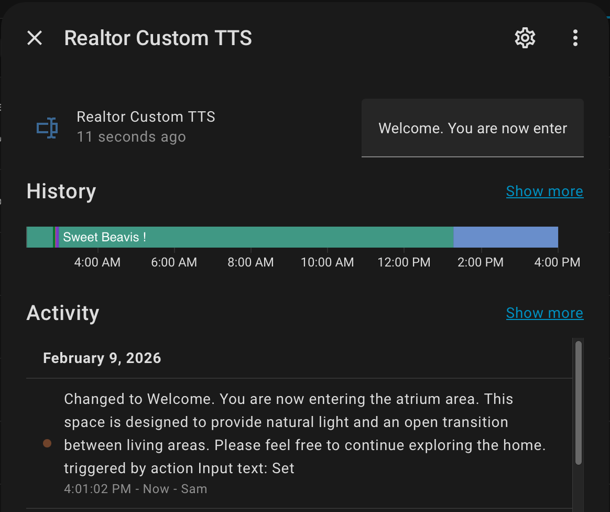
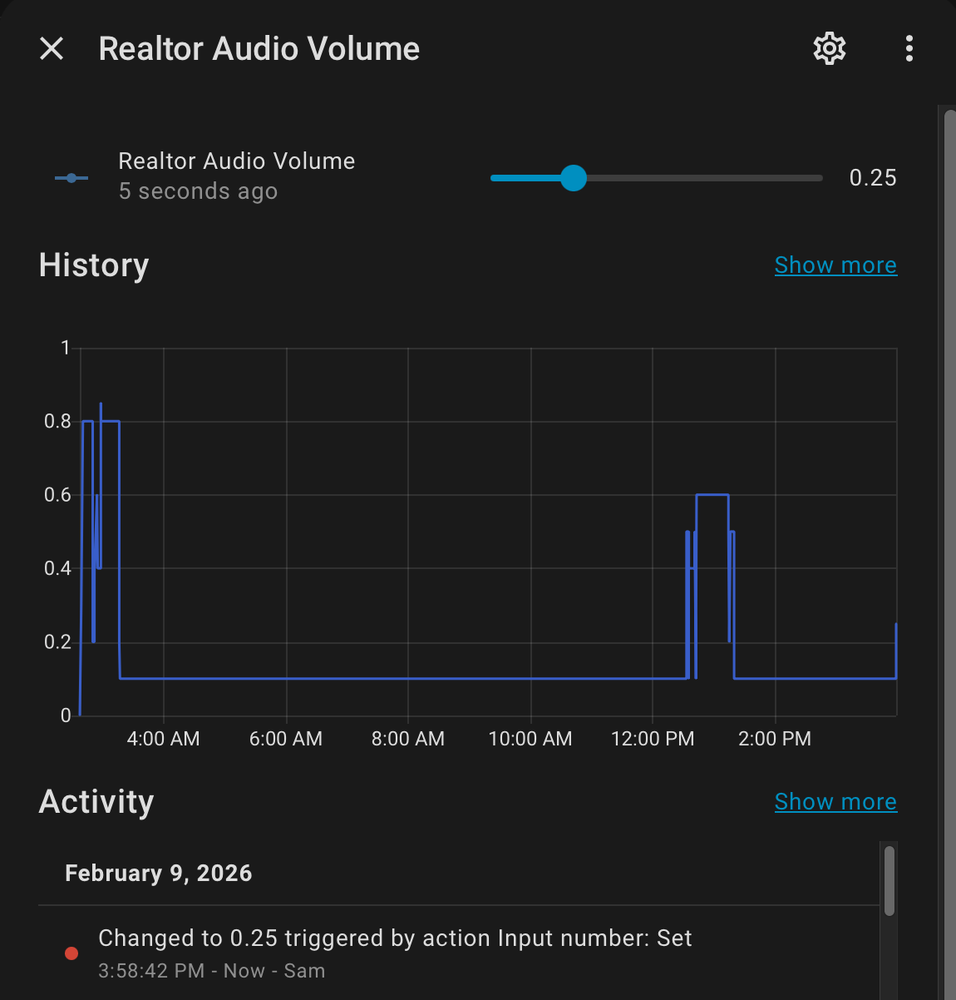

---
# content/customization-options/index.md
title: "Customization Options"
description: "Optional features that allow Smart Showing to be tailored to each property, agent preference, and showing style."
weight: 45
draft: false
---

Smart Showing includes optional customization features that allow each property to be tailored to the agent’s preferences, listing characteristics, and showing style.

These options enhance the visitor experience while maintaining security, consistency, and reliability. Customizations can be adjusted without affecting core safety or access controls.

---

## Motion Activation

Smart Showing can be configured to respond when motion or presence is detected within a property or zone.

This allows the system to automatically activate lighting, narration, or other responses when visitors enter or move through the home.

Motion activation helps:

• Reduce manual interaction  
• Provide a guided showing experience  
• Improve energy efficiency  
• Maintain consistent presentation across visits  

---

## Lighting Customization

Smart Showing allows lighting to automatically activate when motion is detected.

Lighting options may include:

• Individual room lighting  
• Accent lighting  
• Grouped lighting zones  
• Smart switch or power group activation  

Lighting behavior can also be adjusted to respect daytime conditions to avoid unnecessary illumination.

---

## Audio & Narration Options

Smart Showing can provide spoken announcements and guidance during a showing.

Narration can help:

• Welcome visitors when they enter  
• Highlight features or upgrades  
• Provide safety reminders  
• Reinforce showing instructions  
• Enhance professionalism during unattended tours  

Narration can be customized for each property and updated remotely as listing details change.

---

## Custom Realtor Narration Messages

Agents may customize the messages visitors hear throughout the property.

Examples include:

• Welcome messages  
• Feature descriptions  
• Appliance or system guidance  
• Community or neighborhood highlights  
• Exit reminders  

If no custom message is configured, Smart Showing can provide a simple default greeting.

---

## Audio Output Selection

Narration may be directed to specific audio devices or groups of speakers.

Available options may include:

• A single room speaker  
• Multi-room audio systems  
• Whole-home broadcast  
• Disabled audio output  

This allows narration to match the layout and size of each property.

---

## Audio Volume Control

Smart Showing allows adjustable narration volume levels.

Volume may be configured to:

• Provide comfortable listening during showings  
• Increase clarity for security or alert announcements  
• Maintain subtle ambient audio during staging modes  

Volume adjustments occur automatically and do not require visitor interaction.

---

## Narration Cooldown Protection

Smart Showing prevents repeated or overlapping announcements when motion occurs frequently.

This helps:

• Reduce visitor distraction  
• Prevent excessive repetition  
• Maintain a natural and professional experience  

---

## Zone-Based Customization

Customization options can be applied to specific areas of the property.

Examples include:

• Entry zones providing welcome announcements  
• Living areas highlighting home features  
• Kitchen zones providing appliance information  
• Exit zones providing security reminders  

This allows Smart Showing to guide visitors naturally as they move through the property.

---

## Mode-Based Customization

Customization options automatically adapt based on Smart Showing operational modes.

For example:

• Showing Mode – Balanced lighting and guided narration  
• Security Mode – Stronger alerts and security announcements  
• Stage Mode – Subtle lighting and minimal audio  

This ensures the property behaves appropriately for different use cases.

---

## Optional and Flexible

All customization options are optional. Agents may choose:

• Full guided narration  
• Limited narration  
• Lighting-only automation  
• Security-focused automation  

Smart Showing is designed to adapt to each property’s needs while maintaining reliable core functionality.

---

For additional details on system behavior and visitor interaction, see:

• How It Works  
• Modes  
• Notifications & Response  
• Zones
